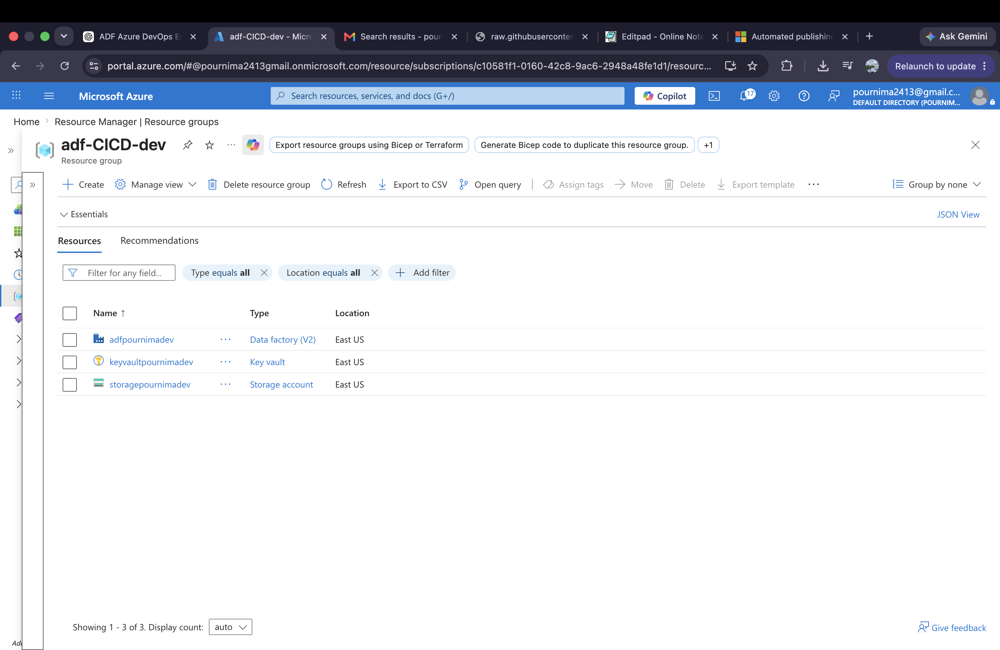
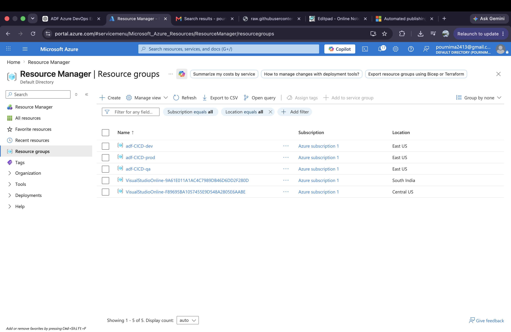
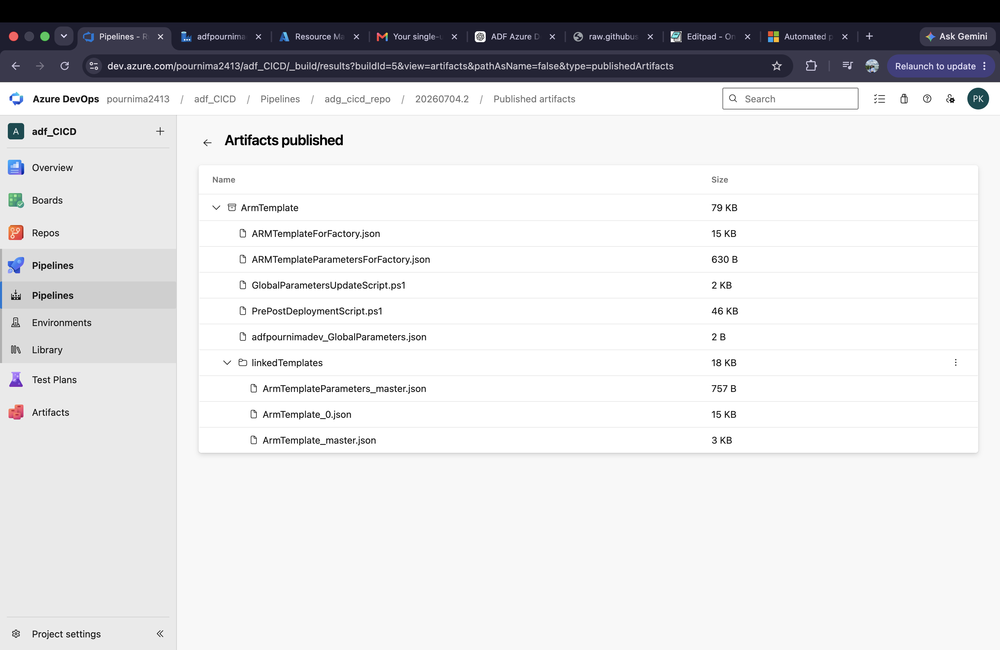

# Azure Data Factory CI/CD Pipeline 

> A hands-on, end-to-end implementation of CI/CD for Azure Data Factory using Azure DevOps, ARM templates, and environment-specific deployments.

I built this project to understand how real data engineering teams move Azure Data Factory (ADF) pipelines safely between environments instead of manually clicking "Publish" in the ADF UI. It covers everything from setting up Azure resources, to writing the DevOps YAML pipelines, to deploying an ARM template through Dev, QA, and Production with an approval gate.

I originally learned the core idea from a YouTube tutorial by Ansh Lamba, but every resource, script comment, explanation, and this entire README were built and written by me, in my own words, based on what I actually did while implementing it. Screenshots below are from my own Azure subscription and Azure DevOps project.

---

## Table of Contents

1. [What This Project Does](#what-this-project-does)
2. [Why CI/CD for Data Factory?](#why-cicd-for-data-factory)
3. [Architecture](#architecture)
4. [Repository Structure](#repository-structure)
5. [Key Concepts Explained Simply](#key-concepts-explained-simply)
6. [Step-by-Step: How I Built This](#step-by-step-how-i-built-this)
7. [The ADF Pipeline](#the-adf-pipeline)
8. [Project Screenshots and Explanation](#project-screenshots-and-explanation)
9. [Common Errors and Fixes](#common-errors-and-fixes)
10. [How I'll Explain This Project in an Interview](#how-ill-explain-this-project-in-an-interview)
11. [What I'd Improve Next](#what-id-improve-next)
12. [Credits](#credits)

---

## What This Project Does

This project automates the deployment of an Azure Data Factory pipeline across three environments — **Dev**, **QA**, and **Prod** — using **Azure DevOps Pipelines**. Instead of manually publishing ADF changes in each environment, a single YAML pipeline:

1. Validates the ADF code in the Dev factory
2. Generates an ARM (Azure Resource Manager) template from that factory
3. Publishes the template as a build artifact
4. Deploys that same artifact into Dev, then QA, then Prod (with a manual approval step before Prod)

The ADF pipeline itself reads a list of files from a JSON parameter file, loops through them, and copies CSV data from a public GitHub repo into Azure Data Lake Storage Gen2.

---

## Why CI/CD for Data Factory?

**CI (Continuous Integration)** means automatically checking that new code is valid and building it into a deployable package every time changes are made. In ADF terms: my CI pipeline checks that all the pipelines, datasets, and linked services in my Dev factory are valid, and then it packages them into an ARM template — a single file that fully describes my factory's configuration.

**CD (Continuous Deployment)** means automatically taking that packaged output and applying it to other environments, instead of a person manually re-creating pipelines by hand. My CD pipeline takes the ARM template built by CI and deploys it to Dev, QA, and Prod, one after another.

Put simply:
- **CI answers**: "Is my ADF setup correct, and can I package it?"
- **CD answers**: "Now let's actually put that package into each environment."

### Why do we need separate Dev, QA, and Prod environments?

In a real company, you never want to build or test something directly in the environment that's serving live business reports or feeding production systems. Three separate environments give you:

- **Dev** – a safe space to build and break things while developing pipelines
- **QA** – a place to test the exact same deployable package before it goes live, catching issues early
- **Prod** – the live environment that the business actually depends on, protected by an approval gate so a real person signs off before anything changes

This mirrors how most data engineering and software teams structure their release process, so it's a good habit to practice even in a personal project.

---

## Architecture


**Flow:**

```
Git Repository (feature branch)
        │  pull request → merged to main
        ▼
Azure DevOps Pipeline triggered
        │
        ▼
   CI Stage (Build ARM Template)
   - Install Node.js
   - npm install
   - Validate ADF resources
   - Export ARM template
   - Publish ARM template as pipeline artifact
        │
        ▼
   CD Stage → Deploy to Dev
   - Download artifact
   - Run pre-deployment script (stop triggers)
   - Deploy ARM template with dev.json parameters
   - Run post-deployment script (start triggers, clean up)
        │
        ▼
   CD Stage → Deploy to QA
   - Same steps, using qa.json parameters
        │
        ▼
   CD Stage → Deploy to Prod
   - Waits for manual approval (Environment gate)
   - Same steps, using prod.json parameters
```

The important idea here: the **same ARM template artifact** is deployed to every environment. Only the parameter file changes. This guarantees that what you tested in QA is exactly what goes into Prod — no drift between environments.

---

## Repository Structure

```
ADF-Azure-CICD/
│
├── README.md                          # This file
│
├── cicd/                              # Azure DevOps YAML pipeline definitions
│   ├── cicd_pipeline.yml              # Main pipeline: wires together CI + CD stages
│   ├── ci_build.yml                   # CI steps: validate ADF + generate ARM template
│   └── cd_deploy.yml                  # CD steps: deploy ARM template to an environment
│
├── parameters/                        # One parameter file per environment
│   ├── dev.json                       # Dev factory name, Key Vault URL, storage URL, etc.
│   ├── qa.json                        # Same structure, pointed at QA resources
│   └── prod.json                      # Same structure, pointed at Prod resources
│
├── architecture/
│   └── Azure-CICD-Architecture.svg    # End-to-end architecture diagram
│
├── screenshots/                       # Evidence of the pipeline actually running
│   ├── resource-groups.png
│   ├── adf-git-config.png
│   ├── variable-groups.png
│   ├── pipeline-run.png
│   └── prod-approval.png
│
└── notes/
    └── learning-notes.md              # My raw, working notes taken while building this
```

### What each file contains

| File | Purpose |
|---|---|
| `cicd/cicd_pipeline.yml` | The entry-point pipeline. Defines the trigger (`main` branch), the build pool, and calls `ci_build.yml` once, then `cd_deploy.yml` three times (Dev, QA, Prod) with different variable groups and environment names. |
| `cicd/ci_build.yml` | Installs Node.js, runs `npm install`, then runs the ADF `npm run build validate` and `npm run build export` commands against my Dev factory to validate it and produce an ARM template folder, which is published as a pipeline artifact. |
| `cicd/cd_deploy.yml` | A reusable template that: downloads the ARM template artifact, runs a pre-deployment PowerShell script (stops ADF triggers), deploys the ARM template using the `AzureResourceManagerTemplateDeployment` task, then runs a post-deployment script (restarts triggers, cleans up deleted resources). It takes the environment name as a parameter so the same file works for Dev, QA, and Prod. |
| `parameters/dev.json`, `qa.json`, `prod.json` | Environment-specific values (factory name, Key Vault base URL, ADLS URL, HTTP linked service URL) that get substituted into the ARM template at deployment time. |
| `architecture/Azure-CICD-Architecture.svg` | Visual diagram of the full pipeline flow shown above. |
| `notes/learning-notes.md` | My personal notes taken step-by-step while setting this up — kept as-is for transparency into my learning process. |

---

## Key Concepts Explained Simply

### What is an ARM template?

An ARM (Azure Resource Manager) template is just a big JSON file that describes what an Azure resource should look like — in this case, an entire Data Factory: every pipeline, dataset, linked service, and trigger, all written out as configuration. Instead of manually recreating a pipeline by clicking through the ADF UI in three different factories, you export this one file once and "replay" it into any environment. Azure reads the file and creates or updates the matching resources automatically.

### Why do we need a separate parameter file per environment?

The ARM template itself is generic — it says "there is a Data Factory with these pipelines," but it doesn't hardcode the factory's actual name or which Key Vault it should talk to. The parameter file supplies those environment-specific values. So `dev.json` points to the Dev Key Vault and Dev storage account, while `prod.json` points to the Prod ones. This lets the exact same template file work across all three environments — only the parameters change, not the underlying pipeline logic.

### Why pre/post deployment scripts?

Azure's ARM deployment for Data Factory doesn't fully support deleting objects that were removed from the source (e.g., a trigger or pipeline you deleted in Dev doesn't automatically get deleted from Prod). Microsoft provides a `PrePostDeploymentScript.ps1` for exactly this reason:
- **Pre-deployment**: stops any currently running ADF triggers so the deployment doesn't conflict with an active run
- **Post-deployment**: restarts the triggers and cleans up resources that no longer exist in the new template

### What do the variable groups do?

Azure DevOps variable groups (`devgroup`, `qagroup`, `prodgroup`) store environment-specific pipeline variables like the Data Factory name, resource group name, and subscription ID, outside of the YAML file itself. This keeps the YAML generic and reusable, and means I can update an environment's settings from the DevOps UI without touching code.

---

## Step-by-Step: How I Built This

1. **Created three resource groups** in Azure: `adf-cicd-dev`, `adf-cicd-qa`, `adf-cicd-prod`
2. **In the Dev resource group**, created:
   - An Azure Data Factory instance
   - A Storage Account (for ADLS Gen2)
   - A Key Vault
3. **In the storage account**, created a container named `raw` and assigned the **Storage Blob Data Contributor** role so Data Factory could read/write to it
4. **Gave Data Factory access** to the storage account and Key Vault using its **System-Assigned Managed Identity**, instead of storing credentials directly
5. **Connected the Dev factory to a Git repository** (Manage → Git configuration) so all pipeline changes are version-controlled
6. **Created an Azure DevOps organization and project** (`adf-cicd`), with a repo (`adf-cicd-repo`) to hold the CI/CD YAML files
7. **Set a branch policy** on `main` so changes require a pull request instead of direct pushes
8. **Created a feature branch** (`feat-<name>-branch`) to build the ADF pipeline safely
9. **Added linked services** in ADF for:
   - Azure Data Lake Gen2 (`ls_adls`)
   - HTTP (`ls_http`) — used to pull CSV files from a public GitHub URL
   - Azure Key Vault (`AzureKeyVault1`)
10. **Built the ADF pipeline**: a Lookup activity reads a list of files/URLs from `params.json`, a ForEach activity loops over that list, and a Copy Data activity inside the loop copies each CSV from GitHub into the `raw` container in ADLS — using dynamic parameters so the same Copy activity works for every file
11. **Merged the feature branch into `main`** through a pull request once the pipeline validated and ran successfully
12. **Wrote the CI pipeline** (`ci_build.yml`) to install Node.js, run `npm install`, validate the factory, and export the ARM template as a build artifact
13. **Wrote the CD pipeline** (`cd_deploy.yml`) to download that artifact and deploy it using `AzureResourceManagerTemplateDeployment`, running the pre/post deployment scripts around it
14. **Wired it all together** in `cicd_pipeline.yml`: one CI stage, followed by three CD stages (Dev → QA → Prod), each using its own variable group and parameter file
15. **Added an Azure DevOps Environment with an approval check** on the Prod stage, so a real approval is required before anything deploys to production
16. **Created variable groups** (`devgroup`, `qagroup`, `prodgroup`) in Azure DevOps Library, and an **App Registration / Service Connection** so DevOps has permission to deploy into my Azure subscription
17. **Ran the full pipeline** end-to-end and confirmed each stage — Build, Dev, QA, Prod — succeeded

---

## The ADF Pipeline

The Data Factory pipeline itself is intentionally simple so the focus stays on the CI/CD mechanics:

- **Lookup activity (`Getparams`)** — reads `params.json`, which contains a list of source URLs and destination file names (e.g., `bookings.csv`, `passengers.csv`)
- **ForEach activity** — iterates over every item returned by the Lookup
- **Copy Data activity** (inside the ForEach) — for each item, copies the CSV file from its GitHub `source_url` into the `raw` container in ADLS Gen2, using the `sink_file` name

This pattern is common in real projects: rather than hardcoding one Copy activity per file, a Lookup + ForEach + Copy combination lets you add new files by just adding a new entry to the JSON, with no pipeline changes needed.

---

## Project Screenshots and Explanation

### 1. ADF Pipeline Success Run


**What it shows:** The ADF pipeline canvas with the `Getparams` Lookup activity, the ForEach activity, and the Copy Data activity nested inside it. The Output panel at the bottom shows the pipeline run succeeded.

**Why it's important:** This proves the actual data movement logic works end-to-end — not just the deployment mechanics around it. The Lookup reads the config, ForEach loops through each file, and Copy moves the data into ADLS.

**What I learned:** Using Lookup + ForEach + Copy together is a much more scalable pattern than writing a separate Copy activity for every file — it's the same idea as looping over a list in code instead of writing repetitive statements.

---

### 2. Dev Resource Group Contents


**What it shows:** The `adf-CICD-dev` resource group containing three resources — the Data Factory (`adfpournimadev`), the Key Vault (`keyvaultpournimadev`), and the Storage Account (`storagepournimadev`).

**Why it's important:** These three resources are the minimum building blocks for any ADF environment: a place to run pipelines, a place to store secrets securely, and a place to land data. Seeing them grouped together confirms the Dev environment is fully provisioned before any pipeline logic runs.

**What I learned:** Keeping all resources for one environment inside a single resource group makes it much easier to manage permissions, track costs, and eventually delete or recreate an entire environment cleanly.

---

### 3. Separate Resource Groups per Environment


**What it shows:** Three separate resource groups — `adf-CICD-dev`, `adf-CICD-qa`, and `adf-CICD-prod` — all under the same Azure subscription.

**Why it's important:** This is the foundation of the whole CI/CD story. Without physically separate environments, there's nowhere safe to test a deployment before it reaches production. Isolating resource groups also means access controls, budgets, and blast radius are all contained per environment.

**What I learned:** In real-world CI/CD, environment separation isn't just a naming convention — it's what makes an approval gate meaningful. If Dev and Prod were the same resource group, "approving a Prod deployment" wouldn't actually protect anything.

---

### 4. Azure DevOps CI Build Succeeded


**What it shows:** The Azure DevOps pipeline's "Build ARM Template" job, showing the published artifacts: `ARMTemplateForFactory.json`, `ARMTemplateParametersForFactory.json`, `PrePostDeploymentScript.ps1`, `GlobalParametersUpdateScript.ps1`, and a `linkedTemplates` folder.

**Why it's important:** This is the CI part of CI/CD in action — my ADF code was validated and successfully compiled into a deployable ARM template package, without me manually exporting anything from the ADF UI.

**What I learned:** The ARM export isn't just the main template — it also includes helper scripts (pre/post deployment) and linked templates for larger factories. Understanding what's actually inside that artifact folder made the deployment stage much less of a "black box."

---

### 5. Production Approval Gate


**What it shows:** The Azure DevOps "Environment" configured for Prod, which requires a manual approval before the deployment job is allowed to run.

**Why it's important:** This is what makes the pipeline safe to run automatically. CI and the Dev/QA deployments run without any human step, but Prod always pauses and waits for a person to explicitly approve it — preventing an untested or accidental change from reaching the live environment.

**What I learned:** Automation and safety aren't opposites. You can automate 95% of the release process and still keep a manual checkpoint exactly where it matters most.

---

> **Screenshot checklist for this repo:**
> - `resource-groups.png` — Azure Portal, Resource Groups list showing dev/qa/prod
> - `adf-git-config.png` — Dev resource group contents (ADF, Key Vault, Storage)
> - `variable-groups.png` — Azure DevOps published artifacts from the CI build
> - `pipeline-run.png` — ADF pipeline canvas with a succeeded run
> - `prod-approval.png` — Azure DevOps Environment approval gate for Prod

---

## Common Errors and Fixes

| Error / Symptom | Likely Cause | Fix |
|---|---|---|
| ARM deployment fails with a Key Vault access error | Data Factory's Managed Identity doesn't have an access policy on the target environment's Key Vault | Add an access policy (Get/List for secrets) for the ADF's system-assigned identity in that environment's Key Vault |
| `npm run build validate` fails in CI | Factory ID in the command doesn't match the actual subscription/resource group/factory name | Double-check the `SubscriptionId`, `ResourceGroup`, and `DataFactory` pipeline variables in the variable group |
| Deployed factory is missing a linked service or pipeline that was deleted in Dev | ARM deployments are additive by default and don't auto-delete removed resources | Make sure `PrePostDeploymentScript.ps1` runs with `-deleteDeployment $true` on the post-deployment step |
| Triggers don't restart after deployment | Post-deployment script didn't run, or failed silently | Check the "Start ADF Triggers" step logs in the pipeline; re-run manually if needed |
| Pipeline fails with a permissions/authorization error against Azure | Service connection doesn't have Contributor access on the target resource group | Recheck the Service Connection's role assignment in Azure DevOps Project Settings |
| CD stage for QA/Prod runs before Dev finishes | Stage dependencies (`dependsOn`) not set correctly in `cicd_pipeline.yml` | Make sure each stage explicitly depends on the previous one and has `condition: succeeded()` |
| Copy activity fails to reach GitHub | HTTP linked service URL or firewall/network rule blocking outbound access | Verify the HTTP linked service's base URL and that the ADF managed VNet (if used) allows outbound HTTPS |

---

## How I'll Explain This Project in an Interview

"I built an end-to-end CI/CD pipeline for Azure Data Factory using Azure DevOps. The goal was to avoid manually publishing ADF changes into multiple environments, which doesn't scale and is easy to get wrong.

I set up three environments — Dev, QA, and Prod — each with its own resource group, Data Factory, Key Vault, and storage account. In Dev, I connected the factory to a Git repo and built a pipeline that uses a Lookup activity to read a config file, a ForEach activity to loop through entries, and a Copy activity to move CSV files from a public source into Azure Data Lake Storage.

For the deployment side, I wrote an Azure DevOps YAML pipeline with two main parts. The CI stage validates the ADF resources and exports them into a single ARM template artifact. The CD stage then takes that same artifact and deploys it into each environment in sequence — Dev, then QA, then Prod — substituting a different parameter file each time so the environment-specific values (factory name, Key Vault URL, storage URL) are correct without changing the underlying template.

I also added pre- and post-deployment PowerShell scripts, which Microsoft provides, to stop triggers before deploying and restart them afterward — and to clean up any resources that were deleted in the source but would otherwise remain in the target environment. Finally, I put an approval gate on the Prod stage using an Azure DevOps Environment, so nothing reaches production without a manual sign-off, even though Dev and QA deploy automatically.

The biggest thing I took away from this project is that CI/CD for data platforms isn't really different in principle from CI/CD for application code — you're still validating, packaging once, and promoting the same artifact through environments — but the tooling (ARM templates, linked service credentials, trigger state) has some data-platform-specific wrinkles you have to account for."

---

## What I'd Improve Next

- Replace the PowerShell pre/post scripts with Bicep for more modern infrastructure-as-code
- Add automated tests that validate pipeline outputs (row counts, schema checks) as part of CD, not just ARM validation
- Parameterize the GitHub source list so new files can be added without touching `params.json` directly in the repo
- Add Slack/Teams notification steps on pipeline success/failure

---

## Credits

I learned the foundational workflow for ADF + Azure DevOps CI/CD from a YouTube tutorial by **Ansh Lamba**. All code comments, this README, the architecture explanation, and the way the repository is organized are my own work, written from my own implementation and notes while building the project.
